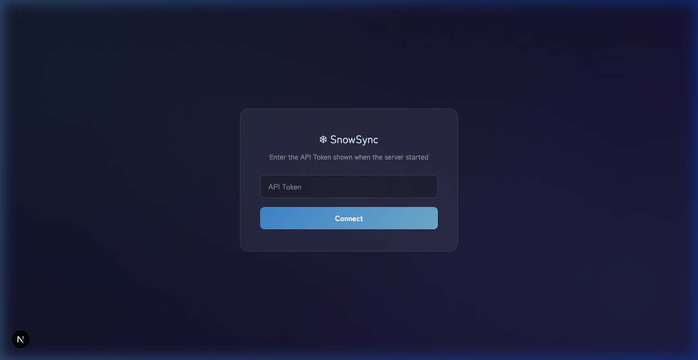
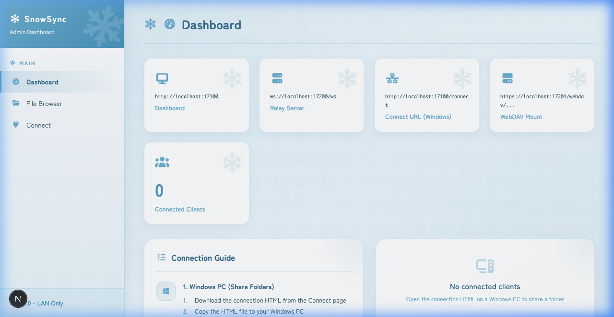
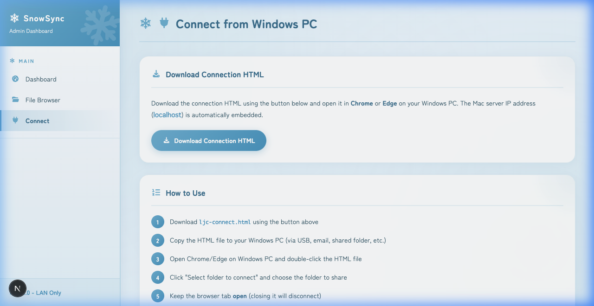
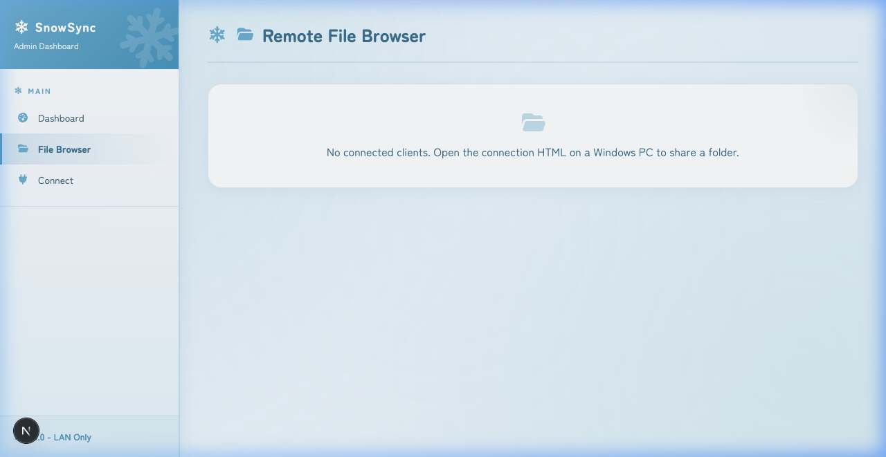

# SnowSync

**[日本語](../README.md)** | **[English](README.en.md)** | **[中文](#)**

### 从 Mac 直接访问 Windows 文件 — 局域网内即时同步

无需云端、无需U盘、无需第三方账号。只需在 Windows 上打开一个文件夹，它就会出现在 Mac 的 Finder 中。

| 登录 | 控制面板 |
|:---:|:---:|
|  |  |

| 连接 | 文件浏览器 |
|:---:|:---:|
|  |  |

---

## 问题

你同时使用 Mac 和 Windows，需要从 Windows 取一个文件，但是：
- 云同步速度慢，占用存储空间
- U盘需要来回跑
- 网络共享（SMB）在 Mac 和 Windows 之间不稳定
- 现有工具需要复杂配置或付费

## 解决方案

SnowSync 只需3步，就能将任何 Windows 文件夹变成 Mac 上的本地驱动器。

1. 在 Mac 上运行 SnowSync
2. 在 Windows 上打开一个网页
3. 选择要共享的文件夹

完成。文件夹会出现在 Finder 中。浏览、编辑、复制 — 就像本地驱动器一样。

---

## 功能

**日常使用：**
- 在 macOS Finder 中直接挂载 Windows 文件夹
- 通过浏览器浏览、上传、下载、重命名和删除文件
- 同时连接多台 Windows PC
- 完全在局域网内运行 — 数据不会离开你的网络

**技术特性：**
- Mac 和 Windows 之间的实时 WebSocket 中继
- WebDAV 挂载，自动 HTTP/HTTPS 切换
- 自动生成自签名 TLS 证书
- 基于令牌的 API 认证
- 使用 Rust（服务端）和 Next.js（控制面板）构建

---

## 快速开始

### 系统要求
- **Mac**: macOS 13+, [Rust](https://rustup.rs/), [Node.js](https://nodejs.org/) 20+
- **Windows**: Chrome 86+ 或 Edge 86+

### 安装

```bash
# 克隆并安装
git clone https://github.com/snowcode-jp/SnowSync.git
cd SnowSync && cd web && npm install && cd ..

# 启动 SnowSync
bash scripts/dev.sh
```

启动时终端会显示 **API Token**：

```
  API Token: xxxxxxxx-xxxx-xxxx-xxxx-xxxxxxxxxxxx
```

复制此令牌 — 登录控制面板时需要使用。

### 登录控制面板

1. 在浏览器中打开 `http://localhost:17100`
2. 粘贴终端中显示的 API Token
3. 点击 **Connect**

### 连接 Windows PC

1. 在 Windows 上打开 Chrome/Edge，访问 `http://<Mac的IP>:17200`
2. 下载并打开连接文件
3. 选择要共享的文件夹 — 完成！

文件现在可以从 Mac 的 Finder 和 Web 控制面板访问。

---

## 工作原理

```
  Windows PC                          Mac
  ┌──────────────┐          ┌─────────────────────┐
  │ 在浏览器中    │  ◄─────► │  SnowSync 服务器     │
  │ 选择文件夹    │ WebSocket│  ┌─ Finder (WebDAV)  │
  └──────────────┘          │  └─ Web 控制面板      │
                            └─────────────────────┘
                你的局域网 — 数据不会上传到互联网
```

## 安全性

- 自动生成令牌的 API 认证
- 挂载路径限制在 `~/Public/mount`
- 命令白名单防止未授权操作
- CORS 锁定为 localhost
- WebDAV 连接的 TLS 加密

---

## 许可证

[MIT License](../LICENSE) - (C) 2026 SNOWCODE / Yukifu Shiki

可自由使用、修改和再分发。

## 免责声明

本软件按"原样"提供，不附带任何保证。使用风险由用户自行承担。
